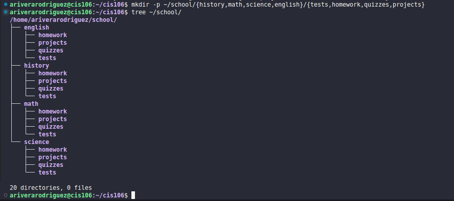

# Question 1

## awk
* Description:
    * awk is used for processing and displaying text and performs operations line by line
* Formula:
    * `awk + options + {awk command} + file`
    * `command output` | `awk + options + {awk command}`
* Examples:
    * how to print the first field of the file:
        * `awk -F':' '{print $1}' /etc/passwd`
    * how to start printing from a different line:
        * `awk 'NR > 3 {print}' /etc/passwd`
    * how to change a field to upper case:
        * `awk -F':{print toupper($1)}'`

## cat
* Description:
    * cat is used for seeing the content of a file. Also used for concatenating.
* Formula:
    * `cat + option + file or files to view/concatenate`
* Examples:
    * how to see the content of a file:
        * `cat /etc/passwd`
    * how to see the content of a file with line numbers:
        * `cat -n /etc/passwd`
    * how to see the content of a file with ending line characters:
        * `cat -E /etc/passwd`

## cp
* Description:
    * cp copies files and directories from a source to a destination
* Formula:
    * `cp + files to copy + destination`
    * to copy directories
      * `cp -r + directory to copy + destination`
* Examples:
    * how to copy multiple files in a single command:
        * `sudo cp -r script.sh program.py home.html assets/ /car/www/html/`
    * how to copy contents of one directory to another:
        * `cp Downloads/wallpapers/* ~/Pictures/`
    * how to copy a file:
        * `cp Downloads/wallpapers.zip Pictures/`

## cut
* Description:
    * cut is used to extract a specific section of each line of a file and display it to the screen
* Formula:
    * `cut + option + file(s)`
* Examples:
    * how to display a list of all users in your system:
        * `cut -d ':' -f1 /etc/passwd`
    * how to cut a file using a delimiter but changing the delimiter in the output:
        * `cut -d ':' -f1,7 --output-delimiter=' => ' /etc/passwd`
    * how to cut the permissions from the output of ls:
        * `ls -l | cut -d ' ' --compliment -s -f1`

## grep
* Description:
    * grep is used to search text in a given file. Works line by line.
* Formula:
    * `grep + option + search criteria + files(s)`
* Examples:
    * how to search any line that contains a specific word:
        * `grep 'word` ~/Documents/file.txt
    * how to search any line that contains a word regardless of case:
        * `grep -i 'word' ~/Documents/Books/dracula.txt`
    * how to search and display total number of times a given word appears in a file:
        * `grep -wc '/bin/bash' /etc/passwd`

## head
* Description:
    * head displays the top N number of lines of a given file. prints the first 10 lines by default.
* Formula:
    * `head + option + file(s)`
* Examples:
    * how to display the fisrt 10 lines of a file:
        * `head ~/Documents/Book/dracula.txt`
    * how to display the first 5 lines of a file:
        * `head -5 ~/Documents/Book/dracula.txt`

## ls
* Description:
    * ls is used for displaying all the files inside a given directory.
* Formula:
    * `ls + option + directory to list `
* Examples:
    * how to list all files, including hidden files:
        * `ls -a ~/`
    * how to list all files sorted by file extension:
        * `ls -S`
    * how to list all files long listed and human readable:
        * `ls -lh`

## man
* Description:
    * man is the system's manual paper. The manual page that is associated with the argument is displayed like a user manual.
* Formula:
    * `man + command`
* Examples:
    * how to list all options of ls command:
        * `man ls`
    * how to list all options of grep command:
        * `man grep`
    * how to list options of awk:
        * `man awk`

## mkdir
* Description:
    * mkdir is used for creating a single, or multiple directories
* Formula:
    * `mkdir + name of the directory`
* Examples:
    * how to create multiple directories:
        * `mkdir wallpapers/cars wallpapers/cities wallpapers/forest`
    * how to create multiple directories using brace expansion:
        * `mkdir -p wallpapers/{cars,cities,forest}`
    * how to create multiple directories and subdirectories using brace expansion:
        * `mkdir -p Documents/{school,work}/{docx,pdf,xls}`

## mv
* Description:
    * mv moves and renames directories 
* Formula:
    * moving files/directories
        * `mv + source + destination`
    * renaming files/directories
        * `mv + source/file or directory + destination/new name`
* Examples:
    * how to move multiple directories using brace expansion:
        * `mv ~/{docx,pdf,xls} ~/Documents`
    * how to move multiple documents to a directory using wildcards:
        * `mv ~/{*.docx,*.pdf,*.md} ~/Documents`
    * how to move and rename a file using brace expansion:
        * `mv ~/{homework1.pdf,homework2.pdf} ~/Documents/pdf/{cis106H1.pdf,cis106H2.pdf}`

## tac
* Description:
    * tac is used for displaying contents of a file in reverse order. tac also concatenates like cat.
* Formula:
    * `tac + option + file(s) to display`
* Examples:
    * how to display the content of a file located in the pwd:
        * `tac todo.md`
    * how to display the content of a file using absolute path:
        * `tac ~/Documents/todo.md`
    * how to add a separator with using tac:
        * `tac numbers.txt --separator "five"`

## tail
* Description:
    * tail displays the last N number of lines given in a file. by default it prints the last 10 lines. opposite of head command.
* Formula:
    * `tail + option + file`
* Examples:
    * how to display the last 10 lines:
        * `tail ~/Documents/Book/dracula.txt`
    * how to display the last 5 lines of a file:
        * `tail -5 ~/Documents/Book/dracula.txt`

## touch
* Description:
    * touch is used for creating files 
* Formula:
    * `touch + name of file.extension`
* Examples:
    * how to create a file:
        * `touch list.txt`
    * how to create a file in multiple directories using brace expansion:
        * `touch ~/docs/books/{history,math}/book.pdf`
    * how to create multiple files in a directory using brace expansion:
        * `touch ~/docs/books/history/{book.pdf,homework.txt,essay.txt}`

## tr
* Description:
    * tr command is used for translating or detecting characters from standard output
* Formula:
    * `Standard Output | tr + option + set + set`
* Examples:
    * how to translate one character to another:
        * `cat file.txt | tr '.' ','`
    * how to translate white space into tabs:
        * `cat program.py | tr "[:space:]" '\t'`
    * how to translate tabs into space:
        * `cat file.py | tr -s "[:space:]" ' '`

## tree
* Description:
    * tree is a recursive directory listing program that produces a depth indented listing of files, which is colorized
* Formula:
    * a
    * a
* Examples:
    * how to print tree files and directories:
        * `tree` or `tree Documents/`
    * how to print tree files and directories in human readable format and display file and directory size:
        * `tree -h`
    * how to list directories only:
        * `tree -d`

# Question 2

* How to work with multiple terminals open?
    * In Tilix you can click the add terminal right or down button and it will open a new terminal
* How to work with manual pages?
    * using the `man` manual pages can be difficult at first but if you take the time to read each option and line, there is no way to be confused or lost
* How to parse (search) for specific words in the manual page
    * Syntax: `man + command | grep searchTerm`
        * Example: `man ls | grep human`
        * Output: -h, --**human**-readable
* How to redirect output (> and |)
    * Using `>`: `Command output + > + file`
        * Example: save output of a command to a file
            * `ls -lA ~ > all-files-in-home.txt`
    * Using `|`: `command_1 | command_2 | command_3 | .... | command_N`
        * Example: Display only the options of the any command from its man page
            * `man ls | grep "^[[:space:]]*[[:punct:]]"` 
* How to append the output of a command to a file
    * `ls -lA ~ > all-files-in-home.txt`
* How to use wildcards
    * For copying and moving multiple files at the same time
        * Copying
            * `cp Downloads/*.png ~/Pictures/png`
        * Moving
            * `mv Downloads/*.png ~/Pictures/png`
* How to use brace expansion
    * For creating entire directory structures in a single command
        * `mkdir -p ~/school/{history,math,science,english}/{tests,homework,quizzes,projects}`
    * Output:
    * 