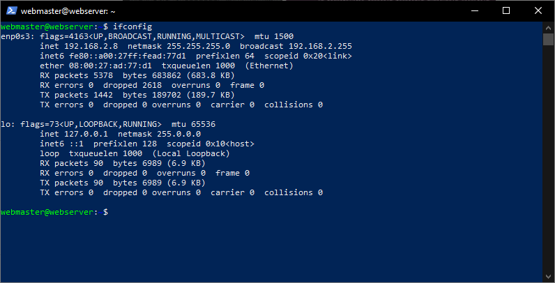
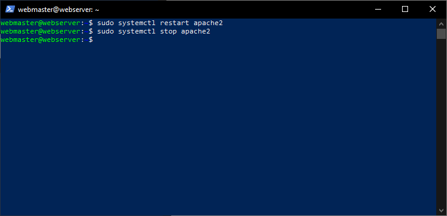

# Deliverable 2

## 1. What are the server hardware specifications (virtual machine settings)?
* 
## 2. What is Ubuntu server log in screen?
* 
## 3. What is the IP address of your Ubuntu Server Virtual Machine?
* 
* `ifconfig`
## 4. How do you enable the Ubuntu Firewall?
* 
* `sudo ufw enable`
## 5. How do you check if the Ubuntu Firewall is running?
* 
* `sudo ufw status`
## 6. How do you disable the Ubuntu Firewall?
* 
* `sudo ufw disable`
## 7. How do you add Apache to the Firewall?
* 
* `sudo ufw allow 'Apache'`
## 8. What is the command you used to install Apache?
* 
* `sudo apt install apache2 -y`
## 9.  What is the command you use to check if Apache is running?
* 
* `systemctl status apache2 --no-pager`
## 10. What is the command you use to stop Apache?
* 
* `sudo system stop apache2`
## 11. What is the command you use to restart Apache?
* 
* `sudo system restart apache2`
## 12. What is the command used to test Apache configuration?
* 
* `sudo apache2ctl configtest`
## 13. What is the command used to check the installed version of Apache?
* 
* `apache2 -v`

## 14. What are the most common commands to troubleshoot Apache errors? Provide a brief description of each command.
  * `systemctl`
      * Used to control and interact with Linux services via the `systemd` service manager.
  * `journalctl`
      * Used to query and view the logs that are generated by `systemd`.
  * `apachectl`
    * When troubleshooting, this command is used to check Apache’s configuration.

## 15. Which are Apache Log Files, and what are they used for? Provide examples and screenshots.
  * These logs are separate from Apache’s request and error logs. journalctl displays logs from systemd that describe the Apache service itself, from startup to shutdown, along with any process errors that may be encountered along the way.

