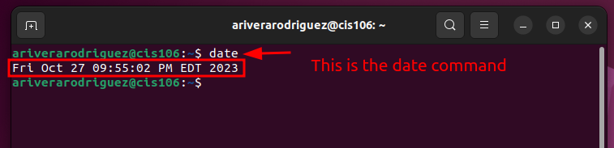
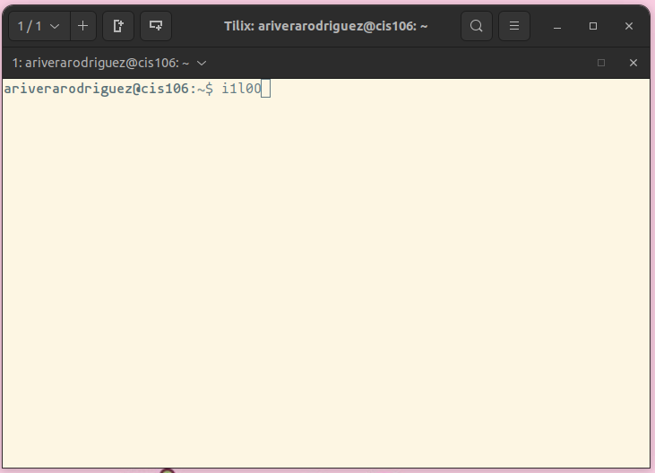
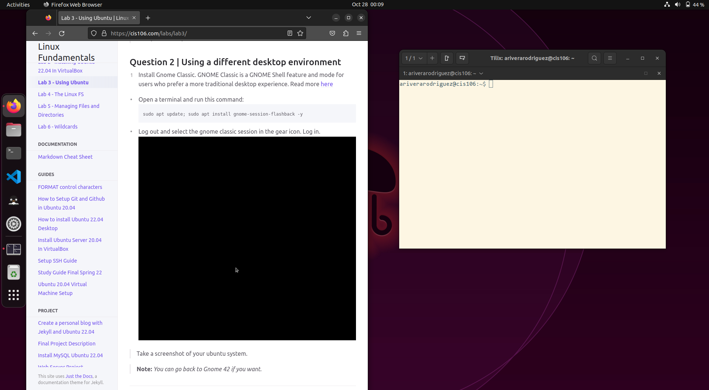

# Lab 3 Using Ubuntu Submission

## Question 1

## Question 2

## Question 3

Command(s) used: `program_name --version` and `sudo apt install program_name`

| Program purpose     | Package Name     | Version                  |
| ------------------- | ---------------- | ------------------------ |
| Play a tetris game  | blockattack      | blockattack 2.7.0        |
| Play a video file   | dragonplayer     | 4:21.12.3-0ubuntu1       |
| Browse the internet | epiphany-browser | Web 42.4                 |
| Read your email     | balsa            | Balsa email client 2.6.3 |
| Play music          | clementine       | Clementine 1.4 rc2       |

## Question 4

| command | what it does                                                                                                                                                                       |
| ------- | ---------------------------------------------------------------------------------------------------------------------------------------------------------------------------------- |
| echo    | Echo the STRING(s) to standard output. Repeats the text input.                                                                                                                     |
| fortune | When  fortune  is run with no arguments it prints out a random epigram.                                                                                                            |
| cowsay  | Cowsay generates an ASCII picture of a cow saying something provided by the  user.                                                                                                 |
| lolcat  | concatenates files, or standard input, to standard output (like the generic cat), and adds  rainbow  coloring  to it.                                                              |
| figlet  | prints  its  input  using large characters (called "FIGcharacters")made up of  ordinary  screen  characters  (called  "sub-characters")                                            |
| toilet  | prints  text using large characters made of smaller characters.                                                                                                                    |
| rig     | Rig  is a utility that will piece together a random first name, last name, street number and address, along with a geographically consistant city, state, ZIP code, and area code. |
