# Week Report 4

## Practice From the Presentation The Linux File System:

### Practice 1
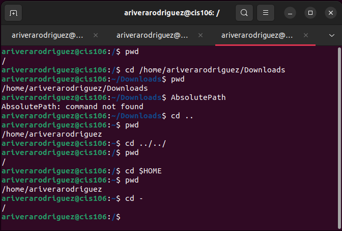

### Practice 2
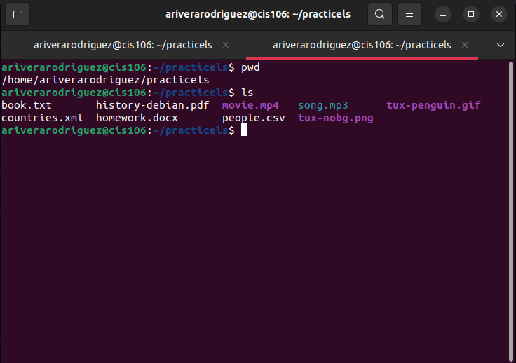
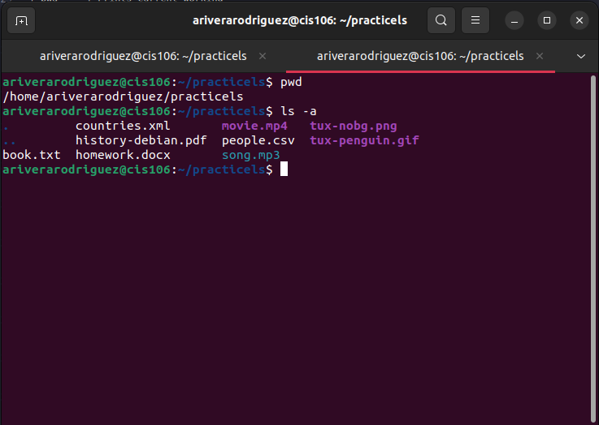
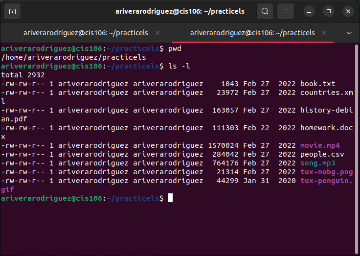
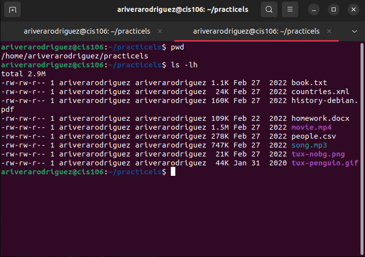
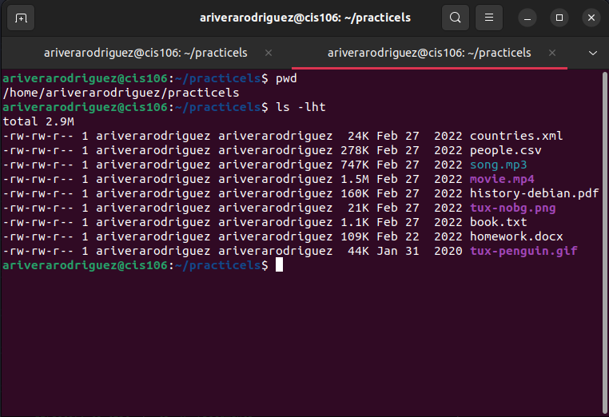
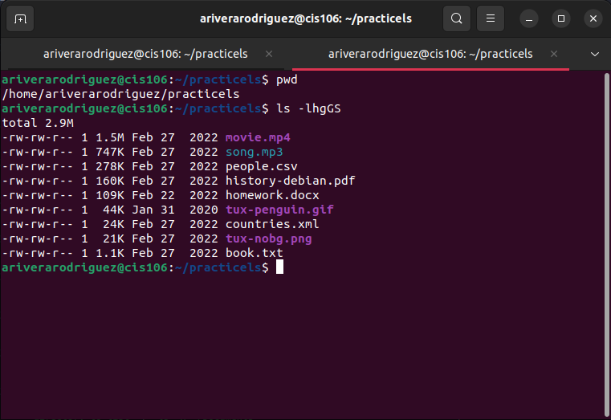
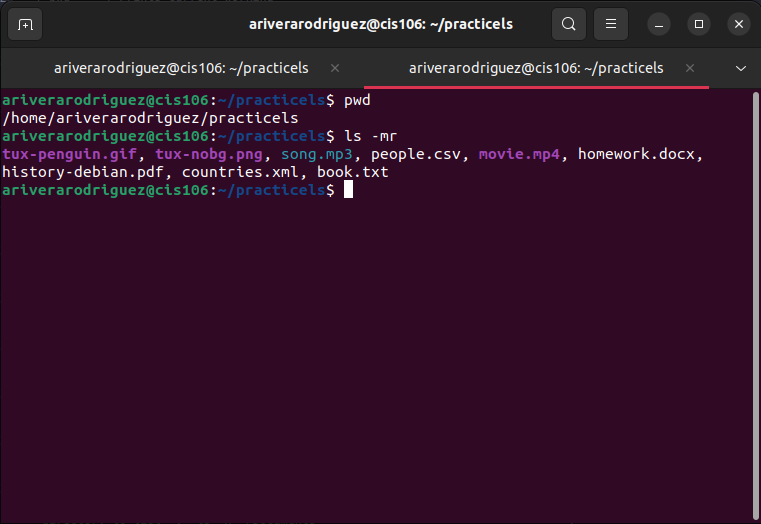
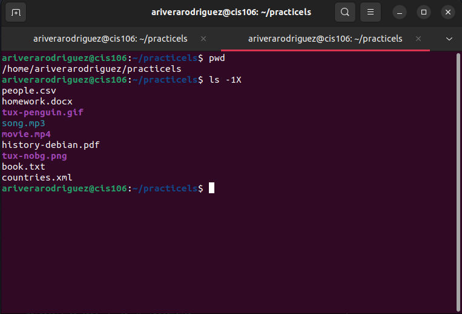

### Practice 3 (Challenge Practice)
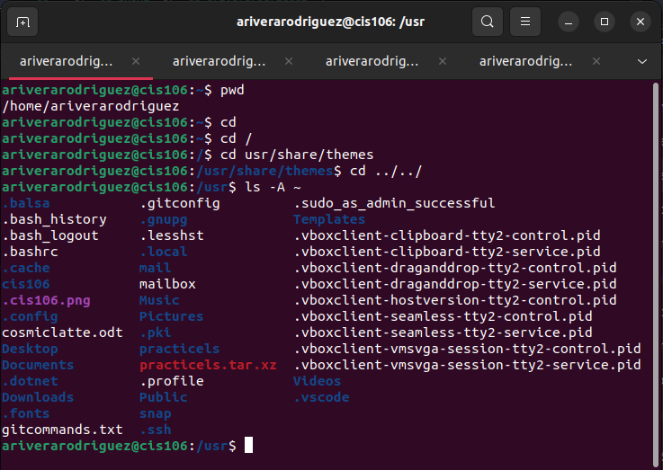
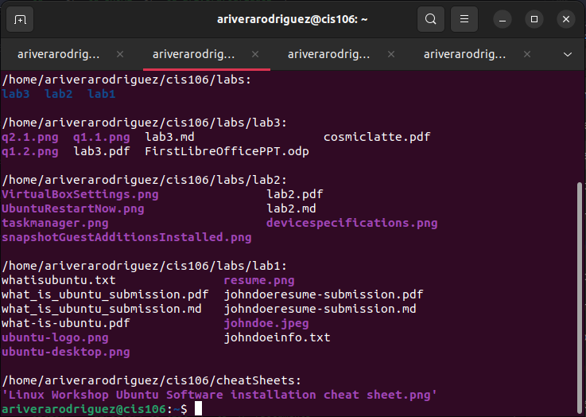
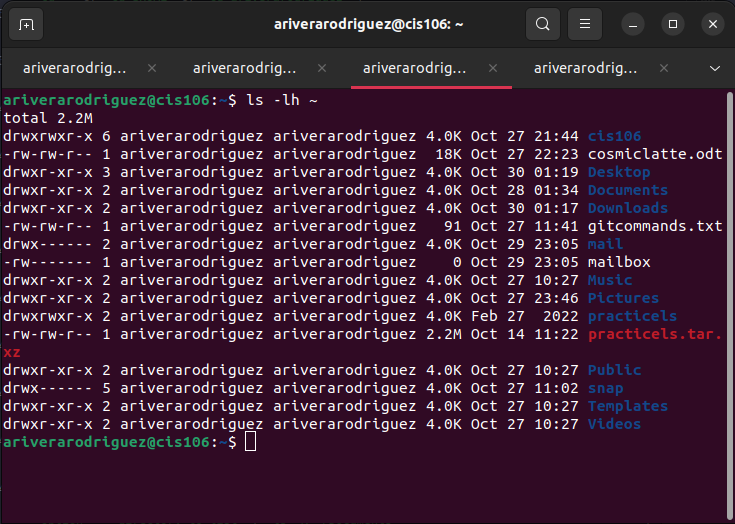
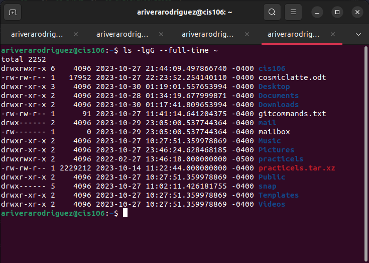

## The Linux File System Directories And Their Purpose:

## All The Commands For Navigating The Filesystem:

| Command | What it does                                                                   | Syntax                                | Example                                               |
| ------- | ------------------------------------------------------------------------------ | ------------------------------------- | ----------------------------------------------------- |
| pwd     | Prints current working directory                                               | `pwd`                                 | `pwd`                                                 |
| cd      | Changes the current working directory to Home                                  | `cd` + `destination`                  | `cd` or `cd ~` or `cd $HOME` or `cd ariverarodriguez` |
|         | Changes the current working directory - Prev working directory                 | `cd` + `destination`                  | `cd -`                                                |
|         | Change from current working directory to a different directory                 | `cd` + `destination`                  | `cd Downloads` or `cd ~/Downloads`                    |
|         | Go back one or more directories                                                | `cd` + `..`                           | Go back 1: `cd ../` Go back 2: `cd ../../`            |
| ls      | Displays all the files inside a given directory                                | `ls` + `option` + `directory to list` | `ls`                                                  |
|         | List all the files inside the current working directory including hidden files | `ls` + `option` + `directory to list` | `ls -a`                                               |
|         | List all the files inside the current working directory                        | `ls` + `option` + `directory to list` | `ls -a ~/Pictures`                                    |
|         | "" sorted by last modified                                                     | `ls` + `option` + `directory to list` | `ls -t ~/Documents`                                   |
|         | "" sorted by file size                                                         | `ls` + `option` + `directory to list` | `ls -s ~/Documents`                                   |
|         | "" sorted by extension                                                         | `ls` + `option` + `directory to list` | `ls -x ~/Documents`                                   |
|         | "" sorted by name descending                                                   | `ls` + `option` + `directory to list` | `ls -r ~/Documents`                                   |
|         | "" recursively                                                                 | `ls` + `option` + `directory to list` | `ls -R ~/Documents`                                   |
|         | Lists all the options of ls command                                            | `ls` + `--help`                       | `ls --help`                                           |

## Basic Terminology

* **File system** The way files are stored and organized.
* **Current directory** The directory where you are at the moment
* **Parent directory** A directory that contains subfolders
* **The difference between your home directory and the home directory** Current working directory is home directory. The home directory is the root where you need administrator privileges.
* **pathname** indicates the location of the file in the filesystem (like an address)
* **relative path** The location of a file starting from the current working directory or a directory that is located inside the current working directory
  * Ex. Downloads/song.mp3
* **absolute path** the location of a file starting at the root of the file system
  * Ex. /home/john/Downloads/song.mp3
