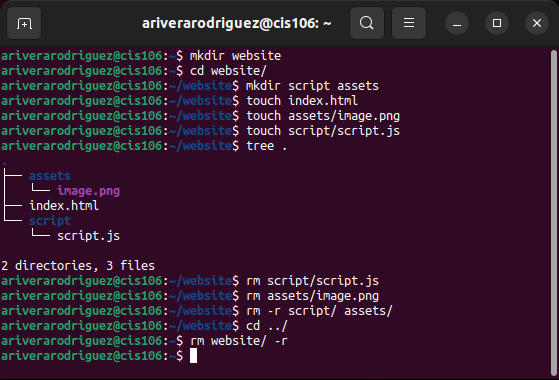
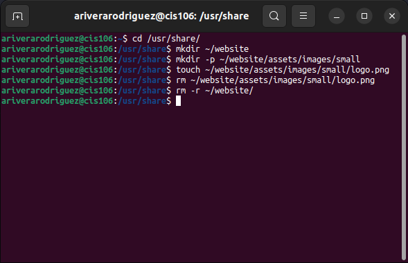
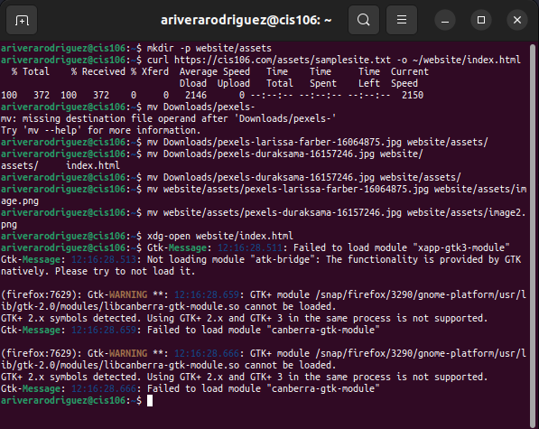
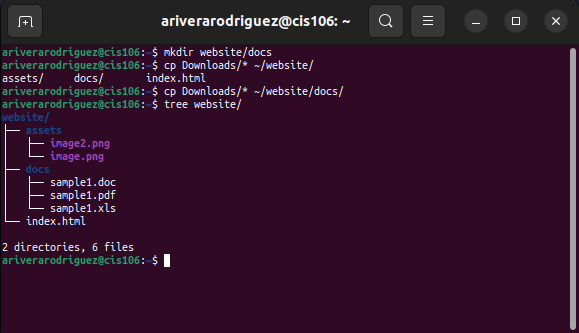

# Week Report 5

## Answers to Questions

* **What are Command Options?**
  Command Options are options that modify/enhance their behavior.
  Syntax: `command -option argument`
  Code: `ls -l ~/Downloads`
 

* **What are Command Arguments?**
  Command arguments are items in which the command acts on.
 
  
* **Which command is used for creating directories? Provide at least 3 examples.**
  The command is mkdir.
  * example 1:
    * Create a directory: `mkdir potatoes`
  * example 2:
    * Create multiple directories: `mkdir movies ~/Downloads/games ~/Documents/hmw`
  * example 3:
    * Create directory with single quotes in the name: `mkdir wallpapers/"majora's mask"`
 

* **What does the touch command do? Provide at least 3 examples.**
  The touch command is used for creating files
  * example 1:
    * Create several files: `touch list_of_cars.txt script.py names.csv`
  * example 2:
    * Create a file using absolute path: `touch ~/Downloads/games.txt`
  * example 3:
    * Create a file with a space in its name: `touch "list of foods.txt"`
 

* **How do you remove a file? Provide an example.**
  The `rm` command removes files.
  * example: `rm list`
 

* **How do you remove a directory and can you remove non-empty directories in Linux? Provide an example.**
  By default `rm` does not remove directories so, to remove a directory use `rm -r`. To remove non-empty directories use `rm -r + directoryName or absolute path`
  * example:
    * Removing a non-empty directory: `rm -r ~/Downloads/games`
 

* **Explain the mv and cp command. Provide at least 2 examples of each.**
The `mv` command moves and renames directories.
  * The basic formula: `mv + source + destination`
  * example 1:
    * Moving a file to another directory: `mv Downloads/homework.pdf Documents/`
  * example 2:
    * Renaming a file: `mv homework.docx cis106homework.docx`
  
The `cp` command copies files/directories from a source to a destination
  * Basic Structure: `cp + files to copy + destination`
  * example 1:
    * To copy a file: `Downloads/wallpapers.zip Pictures/`
  * example 2:
    * To copy content of a directory to another directory: `cp Downloads/wallpapers/* ~/Pictures/`

## Practice 1

## Practice 2

## Practice 3

## Practice 4
