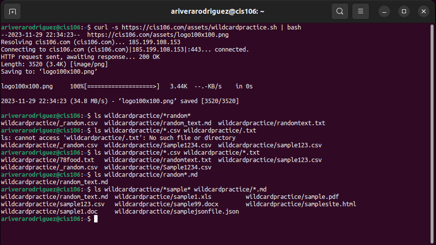
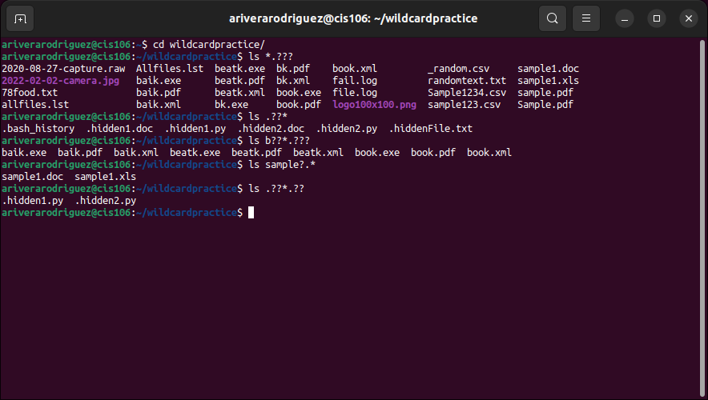
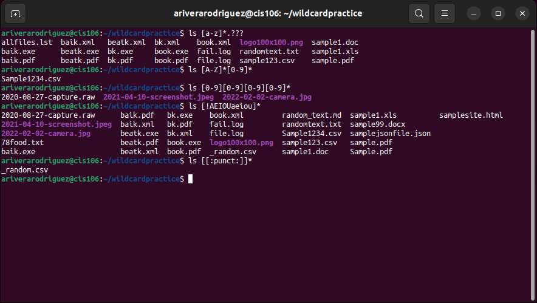

# Week Report 6

## Wildcards

### * Wildcard
The * wildcard matches from 0 to any number of characters.
* Examples: 
  * List all the text files in a directory
    * `ls *.txt`
  * List all the files that start with the word file
    * `ls file*`
  * Copy all the mp4 files
    * `cp Downloads/*.mp4 ~/Videos/Movies/` 

### ? Wildcard
The ? wildcard matches a single character.
* Examples:
  * List all the files that have 3 characters and are followed by the word file in the name
    * `ls ???file*`
  * List all files that have a file extension name of 3 characters
    * `ls *.???`
  * List all txt files that start with "memo" and end with one character.
    * `ls memo?.txt`

### [ ] Wildcard
The [ ] wildcard matches a single character in a range.
* Examples:
  * List all files that have any 3 alphabetical character file extension
    * `ls *.[a-z][a-z][a-z]`
  * List all files whose name does not have a number in their file name 
    * `ls *[!0-9].*`
  * List all files whose name has at least one number:
    * `ls *[0-9]*.*`

### Brace Expansion
Brace Expansion {} is not a wildcard but another feature of bash that allows you to generate arbitrary strings to use with commands.
* Examples:
  * Create N number of files at once
    * `touch memo{1..5}.txt`
  * Create a directory structure in a single command
    * `mkdir -p music/{jazz,rock}/{mp3files,videos,oggfiles}/new{1..3}`
  * Remove multiple files in a single directory
    * `rm -r {dir1,dir2,dir3,file.txt,file.py}`

## Practice

### Practice 5

### Practice 6

### Practice 7
